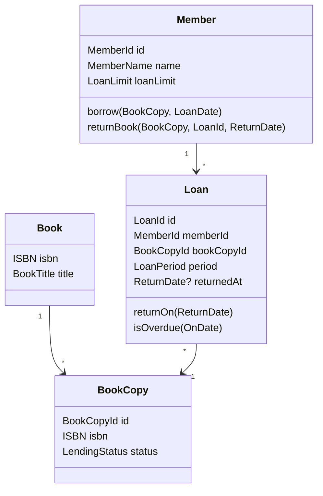

# 図書貸出 DDD 学習課題 設計仕様

## 目的

DDD と Clean Architecture の初学者が、同一の図書貸出システムを Python と TypeScript で実装し、次の要素を学ぶ。

- Entity と Value Object の違い
- Aggregate と Aggregate Root の役割
- ドメインオブジェクト自身による不変条件の保護
- Repository interface による永続化処理との分離
- ビジネスルールをテストで表現する方法
- Infrastructure の技術を変更しても Domain と Application が影響を受けない構造

## 成果物

公開 GitHub リポジトリ `ddd-learning-challenges` に、ブラウザで閲覧する課題 HTML と設計仕様を配置する。Python・TypeScript の実装、設定、依存関係の選定は学習者が行う。

課題 HTML は Mermaid の実行環境や外部 JavaScript に依存しない。ドメインオブジェクト図は Mermaid ソースから生成した SVG として HTML に直接埋め込む。

模範実装は初期状態では公開しない。

## 対象範囲

### 含むもの

- 図書、蔵書、会員、貸出のドメインモデル
- 貸出と返却のビジネスルール
- Repository interface
- ドメインモデルの単体テスト
- Application Use Case
- DynamoDB Local と MySQL の Repository Adapter
- Repository Contract Test と DB 統合テスト
- Python と TypeScript の独立した実装

### 含まないもの

- Web API、CLI、GUI
- 認証・認可
- 予約、延長、紛失、罰金
- 複数図書館や蔵書移管
- 外部サービスとの連携

## 学習ステップ

各言語で次の順に実装する。後続ステップの都合で先行ステップの責務を Infrastructure 側へ寄せない。

1. Domain Model と単体テスト
2. Application Use Case と単体テスト
3. Domain 層の Repository Port
4. DynamoDB Local 用 Repository Adapter
5. MySQL 用 Repository Adapter
6. 両 Adapter に共通の Repository Contract Test
7. Adapter の切り替えによって Domain と Application が変化しないことの確認

## Clean Architecture

教材 HTML では、内側から `Domain`、`Application`、`Interface Adapters`、`Frameworks & Drivers` の順に配置した同心円 SVG で説明する。依存方向は外側から内側への矢印で示す。

- Domain: Entity、Value Object、Domain Service、Repository Port
- Application: 貸出・返却 Use Case
- Interface Adapters: DynamoDB・MySQL Repository Adapter
- Frameworks & Drivers: DynamoDB Local、MySQL、SDK、SQL Client、Bootstrap

依存方向は外側から内側への一方向とする。Domain 層は Application、Infrastructure、DB、SDK、ORM、環境変数を参照しない。Application 層は具体的な Adapter を参照しない。

Repository Port は Aggregate を保存・復元するドメイン上の契約として Domain 層に配置する。DB 接続、データ変換、テーブル作成、トランザクションなどの技術詳細は Infrastructure 層に配置する。

## ユビキタス言語

| 用語 | 意味 |
|---|---|
| 図書（Book） | ISBN と書名で識別される書誌情報 |
| 蔵書（BookCopy） | 図書館が所有し、実際に貸し出す1冊 |
| 会員（Member） | 蔵書を借りられる利用者 |
| 貸出（Loan） | 会員が特定の蔵書を一定期間借りている事実 |
| 貸出日（LoanDate） | 貸出を開始した日 |
| 返却期限（DueDate） | 延滞にならず返却できる最終日 |
| 返却日（ReturnDate） | 実際に返却した日 |
| 延滞 | 未返却かつ、判定日が返却期限より後である状態 |

日付は時刻を含まない暦日として扱う。貸出日当日を1日目と数え、通常の返却期限は貸出日の13日後とする。

## ドメインモデル



### Aggregate

`Member` を Aggregate Root とし、その会員に属する `Loan` を管理する。貸出上限、重複貸出、延滞による貸出停止、返却処理はこの集約内で一貫して判定する。

`BookCopy` は独立した Aggregate Root とし、貸出可能または貸出中という状態を管理する。`Book` は書誌情報を表す読み取り専用の Entity とし、この課題では登録・変更・永続化を扱わない。

Domain 操作では、呼び出し側が取得した `Member` と `BookCopy` を同じ操作へ渡す。操作が成功した場合は両方の状態を変更し、失敗した場合はどちらの状態も変更しない。永続化時の整合性とトランザクション境界は Application と Infrastructure の設計課題とする。

### Value Object 候補

- `MemberId`
- `MemberName`
- `LoanId`
- `BookCopyId`
- `ISBN`
- `BookTitle`
- `LoanLimit`
- `LoanDate`
- `DueDate`
- `ReturnDate`
- `LoanPeriod`

すべてを個別クラスにすることは必須ではない。意味のある制約、比較、計算をカプセル化できているかを評価する。

## ビジネスルール

1. 会員が同時に借りられる蔵書は最大3冊とする。
2. 貸出中の蔵書は借りられない。
3. 貸出期間は貸出日を含めて14日間とする。
4. 未返却で延滞中の貸出が1件でもある会員は、新たに借りられない。
5. 返却日は貸出日より前にできない。
6. 返却済みの貸出を再度返却できない。
7. 同じ蔵書を同じ会員が同時に複数回借りることはできない。
8. ISBN、各種 ID、会員名、書名は空または空白だけの値では生成できない。
9. 貸出上限は1以上の整数とし、本課題で生成する通常会員の上限は3冊とする。
10. 返却期限当日の未返却貸出は延滞ではない。翌日から延滞とする。

違反時に例外、Result 型、明示的なエラー値のどれを使うかは学習者が決定する。ただし、失敗を成功時と区別できず、呼び出し側が見落とせる設計は不可とする。

## Repository

次の interface または抽象型を定義する。

- `MemberRepository`: ID による取得と保存
- `BookCopyRepository`: ID による取得と保存

Repository Port のメソッド、戻り値、不存在と競合の表現は学習者が設計する。Port は DynamoDB や MySQL に固有の型を公開してはならない。

### Infrastructure Adapter

次の2種類を各言語で実装する。

- DynamoDB Local を使用する Repository Adapter
- ローカル MySQL を使用する Repository Adapter

DynamoDB と MySQL の物理データモデルを同じ形にする必要はない。各DBに適した保存形式を選び、変換処理を Adapter 内に閉じ込める。

使用する SDK、SQL クライアント、ORM、マイグレーション手段、コンテナ構成は学習者が選択する。選択理由を提出時に説明する。

### Repository Contract Test

同一の振る舞いを検証するテスト群を、DynamoDB Adapter と MySQL Adapter の両方に適用する。最低限、次を検証する。

- Aggregate を保存して ID で復元できる
- 更新した Aggregate を再保存して最新状態を復元できる
- 存在しない ID の扱いが Port の契約どおりである
- Loan を含む Member Aggregate が情報を失わず復元される
- DB 固有の型や形式が復元後の Domain Model に漏れない

## 受け入れシナリオ

### 貸出成功

- 貸出可能な蔵書を、貸出中2冊以下かつ延滞のない会員が借りる。
- 会員に未返却の貸出が追加される。
- 蔵書は貸出中になる。
- 返却期限は貸出日の13日後になる。

### 貸出上限超過

- 未返却の貸出が3件ある会員が4冊目を借りようとする。
- 操作は失敗し、会員と蔵書の状態は変化しない。

### 貸出中の蔵書

- すでに貸出中の蔵書を借りようとする。
- 操作は失敗し、会員と蔵書の状態は変化しない。

### 延滞中の会員

- 判定日時点で延滞中の貸出がある会員が別の蔵書を借りようとする。
- 操作は失敗し、会員と蔵書の状態は変化しない。

### 返却成功

- 会員が持つ未返却の貸出を、貸出日以降の日付で返却する。
- 貸出に返却日が記録される。
- 対応する蔵書は貸出可能になる。

### 不正な返却

- 貸出日前の日付による返却、または返却済み貸出の再返却を試みる。
- 操作は失敗し、貸出と蔵書の状態は変化しない。

### 延滞境界

- 返却期限当日は延滞ではない。
- 未返却のまま返却期限の翌日を迎えると延滞になる。
- 返却済みの貸出は、判定日が返却期限より後でも延滞ではない。

## 推奨リポジトリ構成

```text
ddd-learning-challenges/
├── README.md
├── index.html
├── docs/
│   ├── specs/
│   │   └── 2026-09-19-library-lending-design.md
│   └── library-domain.mmd
├── challenges/
│   └── 01-library-lending/
│       ├── README.md
│       ├── python/
│       │   └── 学習者が作成
│       └── typescript/
│           └── 学習者が作成
└── .gitignore
```

各言語の実装では `domain`、`application`、`infrastructure`、`bootstrap` の境界が分かる構成にする。具体的なディレクトリ名、テストフレームワーク、依存ライブラリは学習者が決定する。

## 教材 HTML

`index.html` に次を掲載する。

1. 課題の目的と進め方
2. ユビキタス言語
3. SVG として埋め込んだドメインオブジェクト図
4. ビジネスルール
5. 実装対象と対象外
6. 受け入れシナリオ
7. Clean Architecture の依存ルールとDB Adapterの要件
8. 提出時に説明してほしい設計判断
9. 評価基準

HTML はローカルファイルとして直接開いて閲覧でき、CDN や外部フォントに依存しないものとする。

## 評価基準

各言語を100点満点で評価する。

| 観点 | 配点 | 主な確認事項 |
|---|---:|---|
| ドメインモデリング | 30 | 用語とコードの一致、Entity と Value Object の区別、振る舞いの配置 |
| 不変条件の保護 | 25 | 不正状態を生成・保持できないこと、失敗時の原子性 |
| Value Object | 15 | 妥当性検証、不変性、意味のある比較や計算 |
| 責務と Aggregate 境界 | 15 | Aggregate Root 経由の変更、責務の凝集、Repository Port の境界 |
| テスト品質 | 15 | 正常系、異常系、境界値、Contract Test、振る舞いを説明するテスト名 |

上記100点に加えて Clean Architecture と Infrastructure を別枠50点で評価する。

| 観点 | 配点 | 主な確認事項 |
|---|---:|---|
| 依存方向 | 15 | Domain と Application が具体的なDB技術に依存していない |
| Port 設計 | 10 | ドメイン上の契約として自然で、DB固有情報が漏れていない |
| Adapter 実装 | 15 | DynamoDB と MySQL の変換・永続化責務が閉じている |
| Contract Test | 10 | 同一仕様を両 Adapter へ適用し、差し替え可能性を検証している |

各言語150点満点とする。Python と TypeScript の点数に加え、両実装でドメインの意味が一致しているかを講評する。言語固有の慣習に沿った差は減点しない。

## 提出時に説明する設計判断

- どの型を Entity、Value Object、Aggregate Root としたか
- ビジネスルールをどのオブジェクトに置いたか
- 失敗をどのように表現したか
- Aggregate をまたぐ貸出・返却操作の整合性をどう考えたか
- Repository Port を Domain 層に置いた理由
- DynamoDB と MySQL で物理データモデルをどう変えたか
- 使用した SDK、SQL クライアント、ORM、マイグレーション手段の選定理由
- Adapter 差し替え時に変更されるコードと変更されないコード
- Python と TypeScript で設計を変えた箇所と理由

## 今後の課題

図書貸出の評価完了後、同一リポジトリに次の順で課題を追加する。

1. 商品注文
2. 会議室予約

各課題は独立した仕様、HTML セクション、Python・TypeScript 実装領域を持つ。
